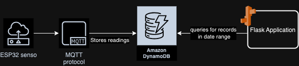

# TempHumidityWebApp

## What is this?
Web application displaying temperatrure and humidity data collected by ESP32 sensor.

## Stack

- Hardware
  - ESP32 board
  - DHT11 Temperature-Humidity Sensor
- Software
  - Backend 
    - Python/Flask application
  - Frontend
    - typescript
    - react

## Running application
When the application is running and there is data present in the selected range:

## Architecture Diagram
Diagram showing the flow of data throught service from ESP32 sensor -> frontend service

## Deploying locally
Start up dev server using the following command:
`./run_app.sh`
this starts up a locally running Flask server.

To regenerate the `main-bundle.js` file run:
`npm run watch`
from inside the static folder.

Navigate to `/view-temp-and-humidity-data`
